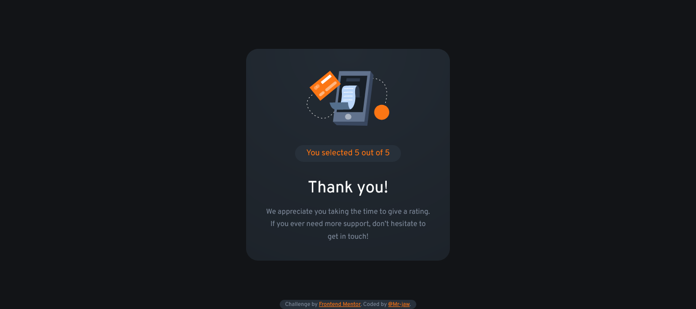
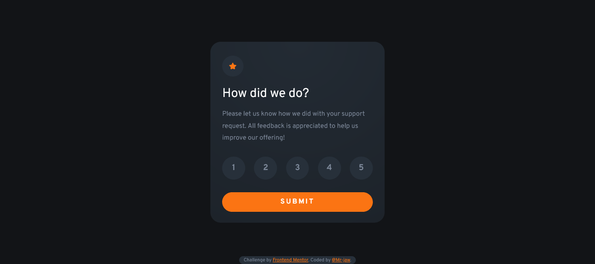

# Frontend Mentor - Interactive rating component solution

This is a solution to the [Interactive rating component challenge on Frontend Mentor](https://www.frontendmentor.io/challenges/interactive-rating-component-koxpeBUmI). Frontend Mentor challenges help you improve your coding skills by building realistic projects. 

## Table of contents

- [Overview](#overview)
  - [The challenge](#the-challenge)
  - [Screenshot](#screenshot)
  - [Links](#links)
- [My process](#my-process)
  - [Built with](#built-with)
  - [What I learned](#what-i-learned)
  - [Continued development](#continued-development)
  - [Useful resources](#useful-resources)
- [Author](#author)


## Overview

### The challenge

Users should be able to:

- View the optimal layout for the app depending on their device's screen size
- See hover states for all interactive elements on the page
- Select and submit a number rating
- See the "Thank you" card state after submitting a rating

### Screenshot





### Links

- Live Site URL: [Live site](https://candid-crepe-2257f7.netlify.app/)

## My process

### Built with

- Semantic HTML5 markup
- CSS custom properties
- Flexbox
- Mobile-first workflow
- Javascript

### What I learned

How to work with the DOM

```js
let rating = "0";

console.log("hi");

function init() {
  console.log("hi");
  document
    .querySelector(".ratings")
    .addEventListener("click", function (event) {
      if (event.target.tagName === "BUTTON") {
        rating = event.target.innerText;
      } else {
      }
      let rating_span = document.querySelector(".rating-selected");
      rating_span.innerText = rating;
    });
}

function submit() {
  let rating_state = document.querySelector(".rating-state");
  let thankyou_state = document.querySelector(".thankyou-state");

  rating_state.classList.add("hidden");
  thankyou_state.classList.remove("hidden");
}

init();
```

### Continued development

Using the DOM more effectively.

### Useful resources

- [MDN docs](https://developer.mozilla.org/en-US/docs/Web/API/Element/tagName) - This helped me to select text which is only inside the button tag rather than whole button container which displays a bug.

## Author


- Frontend Mentor - [@Mr-jaw](https://www.frontendmentor.io/profile/Mr-jaw)


